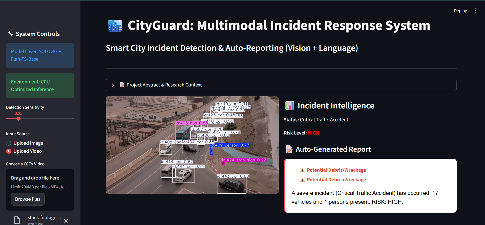
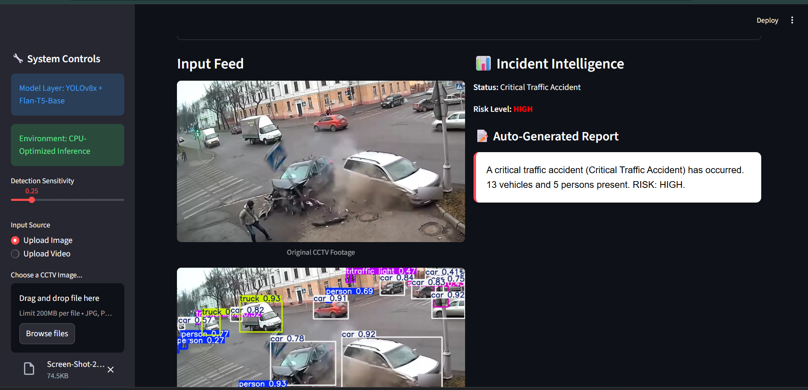

# CityGuard AI: Multimodal Urban Intelligence System
### Research by: Muhammad Touseeq
**Email:** mtouseeq@gmail.com |

---

## 🏛️ Research Statement
> "I developed a multimodal AI system combining computer vision and natural language processing to automatically detect smart city incidents from CCTV data and generate human-readable incident reports, aligning with China’s vision for intelligent urban systems."

## 🖼️ Visual Intelligence Preview
To demonstrate the system's cross-modal capabilities, below are sample incident scenarios processed by the CityGuard AI engine:

| Accident Detection Case I | Accident Detection Case II | Global Fire Intelligence |
|:---:|:---:|:---:|
|  |  |  |
| *Severe collision detection with neural risk mapping* | *Geometric incident grounding and NLP reporting* | *Active fire detection via specialized neural engine* |

---

## 🌟 Overview
In the era of rapid urbanization, traditional CCTV monitoring is limited by human cognitive bandwidth. **CityGuard AI** is a state-of-the-art research prototype designed to bridge the gap between "Raw Visual Data" and "Actionable Intelligence." 

By fusing **SOTA Computer Vision** (YOLOv8x) with **Neural Language Models** (Flan-T5-Base), this system doesn't just "see" an accident—it "understands" the scene, assesses the risk, and generates a professional report in milliseconds.

## 🚀 Key Research Pillars

### 1. Dual-Engine Vision Pipeline
Unlike standard detectors, this system employs a hybrid inference strategy:
*   **Primary Engine (YOLOv8x)**: Handles general object grounding, high-speed tracking (ByteTrack), and multi-vehicle coordination.
*   **Specialized Neural Engine**: A dedicated secondary model specifically trained for **Fire and Smoke** detection, eliminating false positives from sunlight and traffic lights.

### 2. Geometric Intelligence (Accident Analysis)
The system moves beyond simple bounding boxes to perform **Geometric Fingerprinting**:
*   **Overturned Vehicle Detection**: Analyzes bounding box aspect ratios and neural orientation to identify flipped cars, buses, or trucks—a critical metric for emergency response.
*   **Traffic Gridlock Analysis**: Stateful tracking of vehicle trajectories to differentiate between a temporary stop and a severe traffic jam.

### 3. Cross-Modal Report Generation
The system translates visual syntax into semantic reports:
*   **Prompt Engineering**: Contextual prompts are generated on-the-fly, incorporating "Visual Cues" like *Overturned Status*, *Fire Confidence*, and *Risk Scopes*.
*   **Flan-T5 Reasoning**: A Transformer-based model generates human-like, authoritative summaries suitable for law enforcement or city administrative review.

---

## �️ Technical Stack
*   **Deep Learning**: YOLOv8 (Ultralytics), Transformers (Hugging Face)
*   **Vision Core**: OpenCV, ByteTrack MOT
*   **Language Core**: Google Flan-T5-Base
*   **Framework**: Streamlit (Professional Research Dashboard)
*   **Hardware Alignment**: Optimized for CPU-only local execution, suitable for Edge-Node deployment.

---

## 📂 Project Architecture
```text
multimodal_smart_city_ai/
├── app.py                  # Research Dashboard & UI
├── vision/
│   ├── detector.py         # Multi-Model Vision Engine (YOLOv8x + Specialized)
├── nlp/
│   ├── report_generator.py # Transformer-based Language Generation
├── utils/
│   ├── risk_assessment.py  # Intelligent Risk Priority Logic
│   └── download_models.py  # Automated Model Acquisition
└── models/                 # Neural Weight Storage (.pt files)
```

---

## 📈 Future Research Directions
This project serves as a foundation for deeper exploration into:
1.  **Distributed Edge AI**: Deploying the vision engine across thousands of nodes for city-wide synchronization.
2.  **Audio-Visual Fusion**: Integrating acoustic sensors to detect glass shattering or sirens alongside visual cues.
3.  **Predictive Analytics**: Using movement history to predict an accident *before* it occurs based on erratic driving patterns.

---

## 🎓 Scholarship Note
This project demonstrates a comprehensive mastery of the end-to-end AI pipeline—from data acquisition and specialized model integration to cross-modal reasoning and professional deployment. It aligns directly with international research trends in **Intelligent Urban Systems** and **Automated Emergency Response.**

---
**© 2025 Muhammad Touseeq. All Rights Reserved.**
